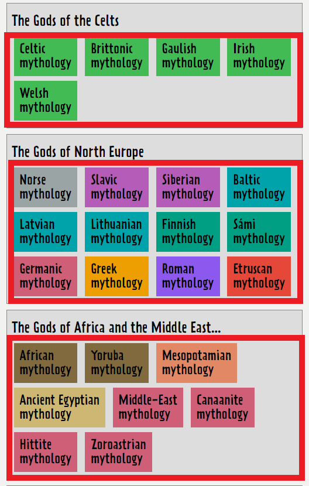

# GodcheckerScrapper
A simple web scrapper to scrape [Godchecker](https://www.godchecker.com/) implemented using Scrapy and stored in SQLite3 database.

## Introduction

The scenario is as follows: You have been tasked by a historian to deep dive into the data. The goal here is to write a book on Religions and Mythology through time, so he is looking to use the data you have prepared (possibly in a SQL-like database for easy access!). The additional analysis on said dataset would also help kickstart the analysis that that would then be done by the data scientist.

There are three main objectives:
1. Your first objective is to scrape all facts and figures of every god from every pantheon
listed on the website. This should be completed in Python/Bash, using any additional
libraries when necessary.
2. Next, store the data in a way you think best fits a data processing/management scenario. Detail your decisions and choices in the README
3. From the data obtained, provide some interesting statistics and insights that you find relevant, interesting, or just fun.

## Architecture and Workflow
I chose [Scrapy](https://scrapy.org/) as one of the possible web scrapper frameworks for python, another well-known framework is [BeautifulSoup](https://www.crummy.com/software/BeautifulSoup/). Scrapy would perform the scrapping workload to find all facts and figures of every god from every pantheon under the website. Afterwards, the data would be stored in SQLite3 database.

The database of choice is SQLite3 database since it is lightweight, self-container, and file-based (does not require server running to function). The SQLite3 database provides broad cross-platform functionality and portability (can be run in Windows, Linux, and Mac OS) without a lot of prior setup. However, the implementation can be easily tweaked to use different RDBMSs such as MySQL and PostgreSQL.

Scrapy would first look at the home page of [Godchecker](https://www.godchecker.com/) to find any links that leads to page describing each mythology (marked as red). Let's say the spider go to the "Norse Mythology" link.

. 

The spider would arrive at the Norse Mythology page where it shows the introduction about that particular pantheon. To explore all the pantheon, the spider needs to go through the "pantheon" left side bar (marked as red).


The pantheon page contains the links to all the pantheon under that mythology. Let's assume the spider choose to explore "Aegir, Norse God of the Sea".


Under Aegir's page, we can see the facts and figures of Aegir (i.e. Name, Pronounciation, Alternative, etc). The spider would help scrape those data and store it in the SQLite3 Database.


## Scrapy architecture

These are the few relevant [components](https://docs.scrapy.org/en/latest/topics/architecture.html) in the implementation:
### 1. Spiders
Spiders are custom classes written byt eh users to parse responses and extract items from them or additional requests to follow. Spiders are the ones that explore the webpages for relevant information (using selectors) and send the result to the Scrapy engine as a request.
### 2. Scrapy Engine
Scrapy engine is responsible for controlling the data flow between all components of the system, and triggering events when certain actions occur. Think of it as Scrapy's brain.
### 3. Scheduler
The scheduler receives requests from the engine and enqueues them for feeding them later when the engine requests them.
### 4. Downloader
The downloader is responsible for fetching web pages and feeding them to the engine whicch, in turn feeds them to the spiders.
### 5. Item Pipeline
The Item Pipeline is responsible for processing the items once they have been extracted (or scraped) by the spiders. The tasks include cleansing, validation, and persistence (storing item to the database). This is where most processing and storage works exist.

## Setup
We will be using Python 3 for this project.

### Install pip
pip is a handy tool to install libraries/dependencies for your python programs. pip should already come installed on your system. Head over to https://pip.pypa.io/en/stable/installing/ for steps to install pip if it's not available.

### Install virtualenv
We use virtualenv to create an isolated running environment to install dependencies and launch the web application. Head over to https://virtualenv.pypa.io/en/stable/installation/ for instructions to install virtualenv

### Install SQLite3 
The RDBMS used is SQLite3, you can use this  to install SQLite3. The SQLite3 command needs to be used to explore the database.

### Install dependencies
Once you have pip and virtualenv set up, we can proceed to create the environment to run our web applications:

```bash
# Locate the path for the Python 3 installation
which python3

# Create the virtual environment in a folder named "env" in the current directory
virtualenv env --python=<path_to_python_3>

# Start the virtual environment
source env/bin/activate

# Install the required dependencies/libraries
pip install -r requirements.txt
```

You'll see `(env)` show up at the beginning of the command line if you've started virtual environment successfully. To check if the dependencies are installed correctly, run `pip freeze`.

# Running the scrapper

We will start by scrapping the website using `scrapy crawl`. To start scrapping the data, go to the `/godchecker` directory and run the command below:

```bash
# Go to the godchecker directory
cd godchecker
# Run Scrapy
scrapy crawl godchecker -O godchecker.json
```

If you want to save the logs in a file called `godchecker.log`, you can override the `--logfile` option:
```bash
scrapy crawl godchecker -O godchecker.json --logfile godchecker.log
```

After Scrapy finished scrapping the website (will only take 1-2 minutes). There will be SQLite3 file generated under `/godchecker/god.db`. 

There is also a script `viewCreator.py` that would generate SQL views that partition the main table according to its pantheons as well as generate a view that contains interesting statistics regarding the database. To generate the views and see the list of all views, run the commands:
```bash
# To generate the views
python viewCreator.py
```

After generating the database and views, run the `sqlite3` command to access the database:
```bash
sqlite3 god.db
```
To display the headers and the align the rows based on the columns, use these commands:
```sql
.header on
.mode column
```
While inside the database, you can run your usual SQL queries to explore the database. To see what views are created for each pantheon you can use the command:
```sql
SELECT name from sqlite_master WHERE type ='view';
```
Examples of the view names are `polynesian_gods`, `maori_gods`, and `japanese_gods`. The statistics view is stored under `statistics`.

## Database Design

The data extracted by the scrapper are stored in a "master table" called `gods` which contains every possible attributes under the "Fact and Figures" section, the schema is as follows:


Most of the data extracted have missing values except for  `name` and `mythology`. Since the data are used by a historian to write a book on Religions and Mythology through time, I decided to create a `VIEW` for every single mythology / religion. This helps the historian to focus on the particular mythology / religion while writing a chapter about it. For example, if the historian would like to search for all the evil polynesian gods, he just needs to query:
```sql
SELECT name from polynesian_gods WHERE good_evil in ('NOT OKAY', 'BAD', 'TOTALLY EVIL');
```
The historian does not need to specify the mythology he is using all the time.

In addition, to help generate some insights about the data, I have created another view that contains interesting statistics that could prove useful when analysing the data. The statistics are by no means complete, and I would like to hear more about suggestion regarding what results are relevant for the data. The view is created by using `NATURAL JOIN` on the `mythology` attribute. Each column row would be a statistics for that particular mythology. The view schema is as follows:


## Interesting statistics and insights

From the views and the statistics views, one can derive some interesting insights about the data:

> Disclaimer: The analysis only depends on the pantheons that are available from [Godchecker](https://www.godchecker.com/)

### Mythology with the most evil gods
```sql
SELECT mythology, evil_gods_count from statistics ORDER BY evil_gods_count DESC;
```
It can be seen that the most potrayal of evil gods exist in Hindu mythology (43 gods), followed by African mythology (20 gods).

### Mythology with the most good/benevolent gods
```sql
SELECT mythology, good_gods_count from statistics ORDER BY good_gods_count DESC;
```

Interestingly, the portrayal for the most good/benevolent gods also held by Hindu mythology (133 gods), followed by African mythology (109 gods).
This could happen due to multiple reasons:
1. There are multiple gods where the `Good/Evil Rating` are set to `Unknown at present`, or `Neutral`. Hence it cannot be categorized under good/evil spectrum.
2. Some large mythology is divided into smaller mythologies. Hence, large mythology that does not have a lot of sub-mythologies have more gods inside and therefore the result might be skewed.

### Gender that is often portrayed as good
```sql
SELECT SUM(good_males_count), SUM(good_females_count) from statistics;
```
There are 346 male gods and 159 female gods that are portrayed as good. This could partly due to number of male gods outweighing the number of female gods.
```sql
SELECT SUM(evil_males_count), SUM(evil_females_count) from statistics;
```

### Gender that is often portrayed as evil

There are 96 male gods and 44 female gods that are portrayed as evil. Again, this could partly due to the number of male gods outweighing the number of female gods.

However, further analysis reveals an interesting result. By finding out the number of male gods compared to female gods:
```sql
SELECT COUNT(name) FROM gods WHERE gender = 'Male';
SELECT COUNT(name) FROM gods WHERE gender = 'Female';
```
We have 2438 male gods and 1190 female gods. The female and male ratio is 0.48. If you see from the portrayal of evil and good gods you can see similar ratio (0.45 and 0.46). This could indicate that the good/evil spread among both genders are similar.

### Mythology that gets you the most holidays

This is calculated by finding the feast_day_count from statistics.

```sql
SELECT mythology, feast_day_count FROM statistics ORDER BY feast_day_count DESC;
```

The result indicates that Christian religion has the most feast day count among all the mythologies.

### Mythology that has the most varied types (e.g. spirits, god, and legendary mortal)

```sql
SELECT mythology, distinct_types_count FROM statistics ORDER BY distinct_types_count DESC;
```

The result shows that Hindu mythology has the most types of beings (19 types) followed by Australian mythology (16 types).
